## About the data:
The data selected is a shoe data that was obtained from the web site named data world. The data was not pre-processed and was given in its raw form. We had to use regular expressions and scripts to pre-process the data.

## Tools used:
Python and Tableau

## Case 1:
The weights were given directly as strings with both value and its unit combined. As script was written to break the string into an integer(value) and string(unit). The values were all brought from different units like lbs, grams, pounds, kgs etc into a single unit called “kg”.
There was another challenge where g and grams both represented grams. This was the case with other units too, they were grouped together to a single unit and then converted to kgs.
## Case 2:
The categories were given in a format that was very inconvenient for data visualization. For example, “Athletic and outdoor shoes, hunting boots, shoes, Men’s shoes” as a category name and “Athletic and running shoes, Men’s shoes, Running shoes”. While both the categories are slightly different, they have a common name athletic. We choose to replace many of the sub-categories with common names. To achieve this custom split option with space delimiter was used.
## Case 3:
Shoes were marked with different colors and that data has to be analyzed. Two unique challenges were encountered in this case. In the first one there were many sub colors for each color and was hard to be visualized. For example, black had sub colors like anthracite black, charcoal black, and so on. To overcome this problem, similar colors were grouped into a single entity and named with an alias containing a common name.
The second challenge was each product contained more than one colors in its description. There was no mention of the majority color in that table. So we assume the first name as its major color and grouped with the same. One solution could be the use of Venn diagrams to represent the share of each color sales, but given the no of different colors intersecting with each other, that option is not feasible.

## Earnings on each color:

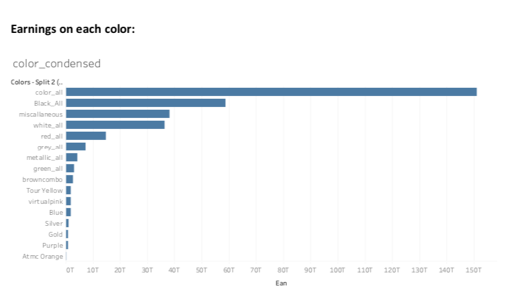

From the above bar chart, we can infer that multi-color shoes and black, white color shoes are very popular among customers. Whereas purple and other such colors are less popular. We can use this to increase or decrease the production of specific colors.

## Brands with highest earnings:
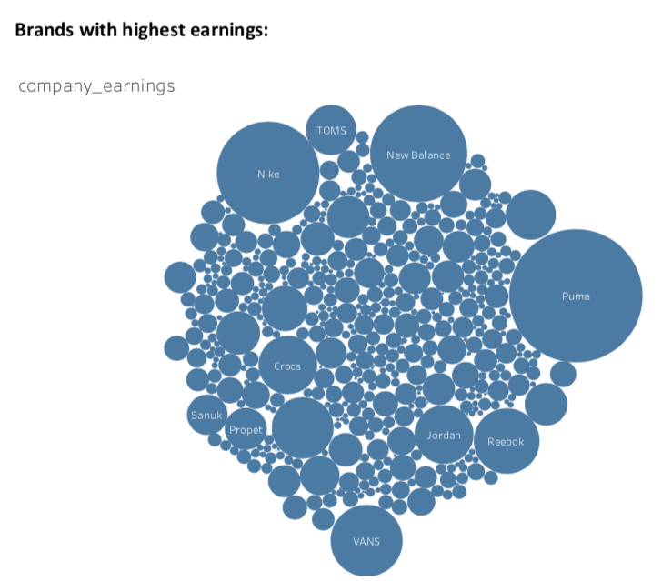

In this chart, size of the bubble indicates its earnings. It can be clearly seen that puma brand is the highest earner of all the brands.

## Effect of offer names on sales:
## Challenges encountered:
There were different kinds of discounts given by different websites. The offers were named reduced 10$, reduced 50$, discount 30%, discount 40% and so on. Though the naming is different the offers are basically the same. We wanted to find out which naming convention was pulling more customer attraction.

## Solutions:
We used a tree map to visualize the share of offers, we could have used a bar graph but one of the outputs is very high and would become difficult to compare results of other smaller outputs, so tree map was used instead.

## Inference:
It is observed that the offers named “reduced” are pulling more customers than any others. But this conclusion might be distorted by the fact that different websites are employing different naming conventions and it is the website popularity rather than the effect of naming convention on customers.
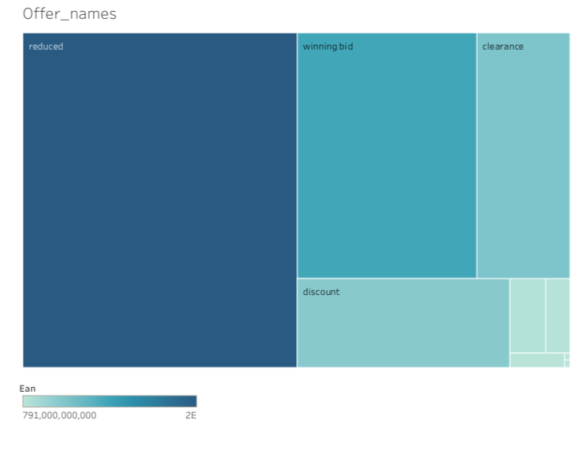

## Customer shopping pattern across hours of a day:
As we can observe from the data the sales are high early in the morning at 6’0 clock.
We can understand that shopping rate is high in this period and increase ad postings during this time. There is sharp decline in sales at 7’0 clock and 8’0 clock as this is the time when users go to their work and shop less. The shopping rate is again at its peak at 1’0 clock at night. So there is no use in posting ads during this time, as it would irritate the users without yielding any results. Peak hours are observed during 1,6,9,11,14.
But this doesn’t tell the whole story as users shopping behavior might be different during different during days,
for example during weekends they might be waking up late and shopping might be less at 6’0 clock.

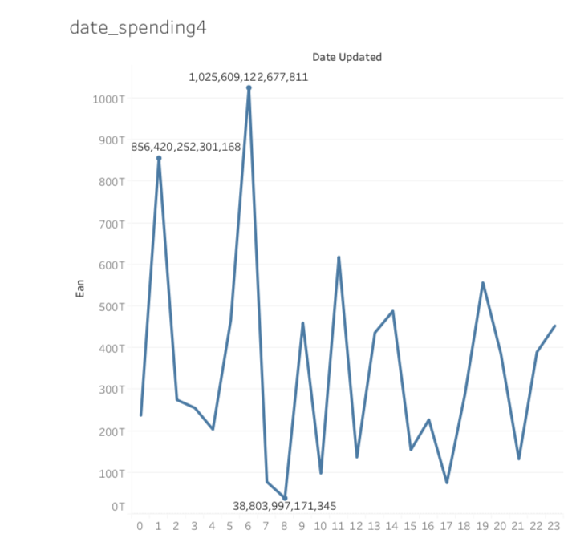

## Customer shopping pattern on Sunday:
As we have guessed, the shopping patterns are different during weekends, i.e users are not shopping at 6’0 clock early in the morning but are shopping more at 11’0 clock. As users regularly wake up at 6’0 clock, the general graph shows us that are actively shopping immediately after they wake up. This also tells us that majority of users are waking up late during weekends.
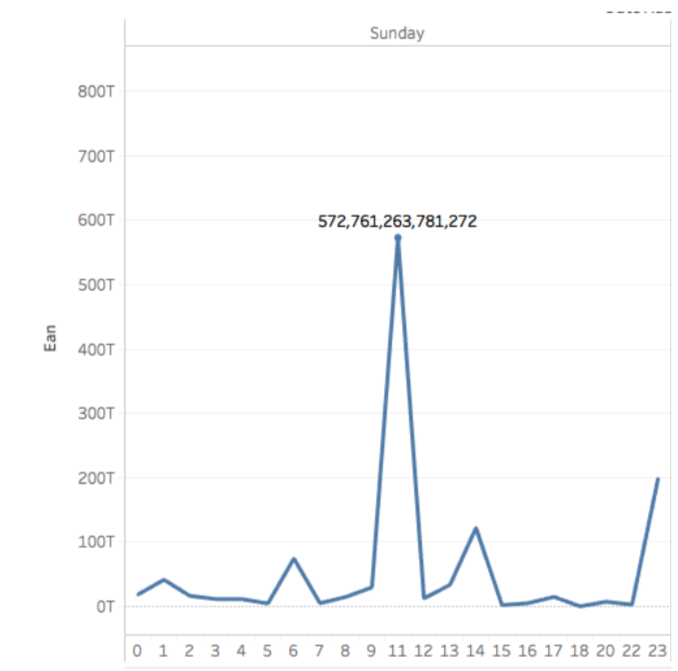

## Customer shopping pattern on Thursday:
Here, we can observe that the conclusion about users shopping at 6’0 clock has been distorted by the stats from Thursday. If we observe sales from all weekdays, only on Thursday the sales have been abnormal. So we can disqualify our previous conclusion that users shop abnormally high early in the morning. We come to conclusion that users shop abnormally high only on Thursday mornings. This can be due to working customers being highly active during mid- week and that reflects on customers shopping early in the morning.
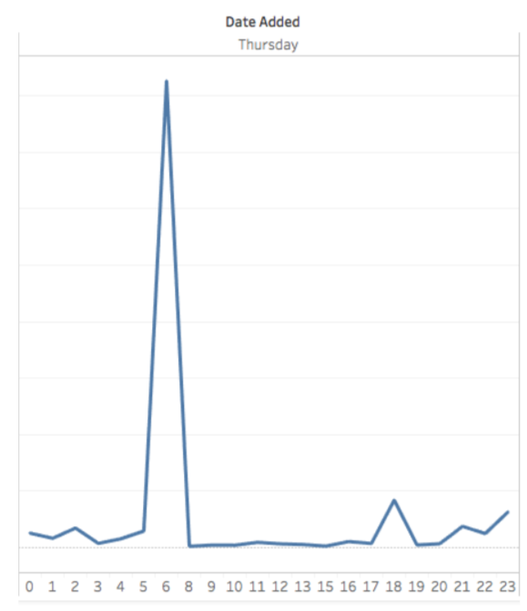

## Customer shopping pattern on Friday:
As we can observe from the above visualization, customers are shopping heavily on Friday nights, especially at 1’0 clock. This can be attributed to the fact that users sleep late as they have holiday on Saturday and Sunday and hence shop late at night.
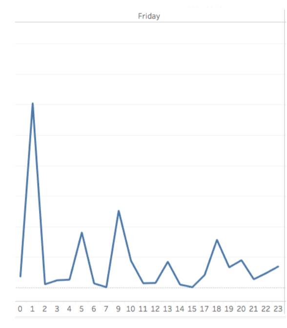

## Spending across weekdays:
Here, we observe an interesting pattern in sales across week days. Generally, we assume that more sales are made on weekends like Saturday and Sunday. While it is correct with offline sales where users shop on weekends, contrarily online shoppers expect the order to delivered on weekend. They wouldn’t be available at home on weekdays generally and hence order a two days before weekend expecting the order to be delivered on weekend.
 
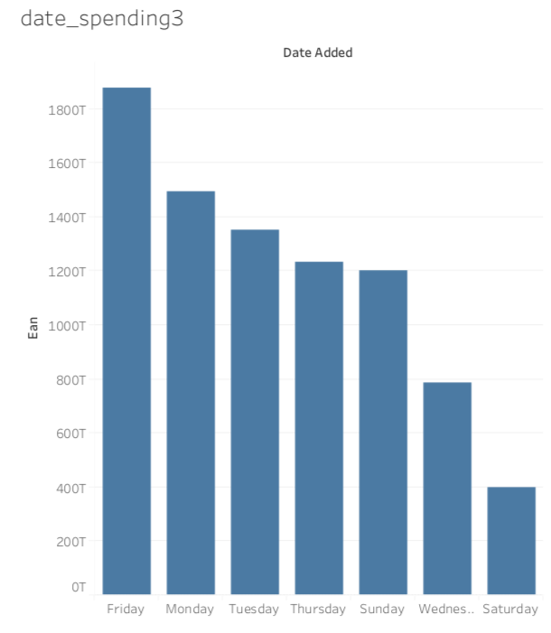

## Rise in online sales during 2016:
As we can infer from the above graph, online sales have rocketed between 2015 and 2016. We have omitted data from 2017 as only few months of data was available for that year.

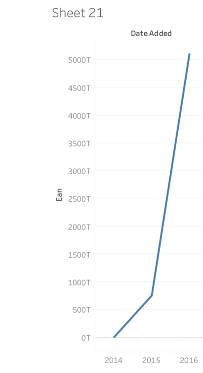

## Best sales category in every month:
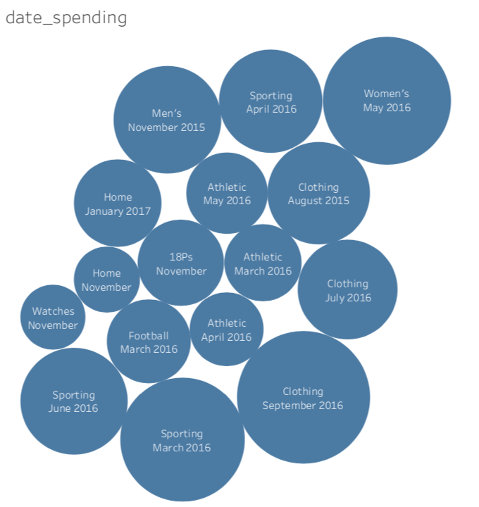
These are the few points observed from the above data.
1. Clothes are sold more during months July, August and September
2. 18 plus shoes are sold more during November
3. Men’s products are in high demand during November
4. Women product sales are high in the month of May.
5. April, May and June are the months for sports and athletic products.

## Correlation between discount and prices:
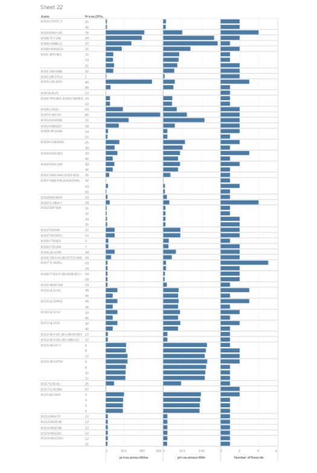
Generally, there are claims from customer complaining that discounts are bogus. It is assumed that online websites rise their prices and then give more discounts to attract people to buy products from their website. When we plotted a chart to see if it is true, we found some interesting results. Not only the prices have remained same in most case, the product prices also dropped simultaneous to discount offer. This might be due to the willingness of sellers to sell out the outdated stock. Nevertheless, there are few cases prices have been raised in case of discounts.

## Forecasting sales for next few weeks:
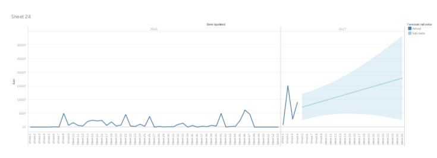
The above graph is week wise earnings of all websites combined. When forecasting was done on the above data, we observed a linear increase in earnings for few weeks.

## No of sales across different return policies:
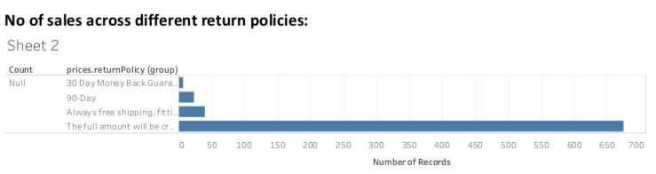

From the above bar graph, we can observe that online customers are willing to buy if they are given full money back in case of returns. This may be due to no confidence in online shopping, especially regarding expensive items.

## Visualization of sentiment analysis:
Reviews were selected and exported into csv files. This csv file was pre-processed to extract only reviews. Each review of every product was put into a different row and a maximum of seven review were taken. Sentiment analysis was done on each of these reviews and the polarity of sentiment was exported into csv file.
This file was imported into tableau to visualize the reviews as heat map. Red values indicated negative average values and blue values represented positive reviews.
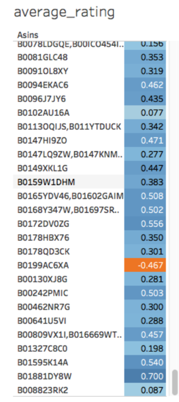

## Web sites with highest sales:
We decided to find which company was selling more products. This might help specific brands to become exclusive partners with online websites. For example, Oneplus has exclusive partnership with amazon.com. As we can clearly understand that walmart has been selling highest number of products in the online space.

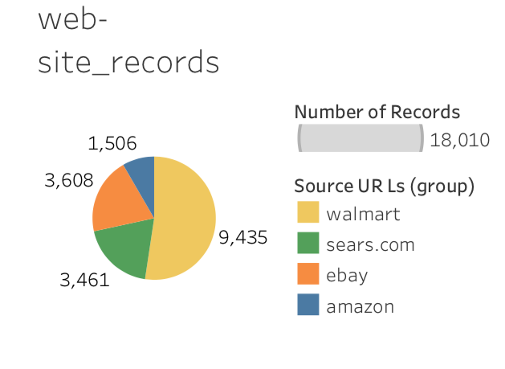

## Finding premium brand among all the brands:
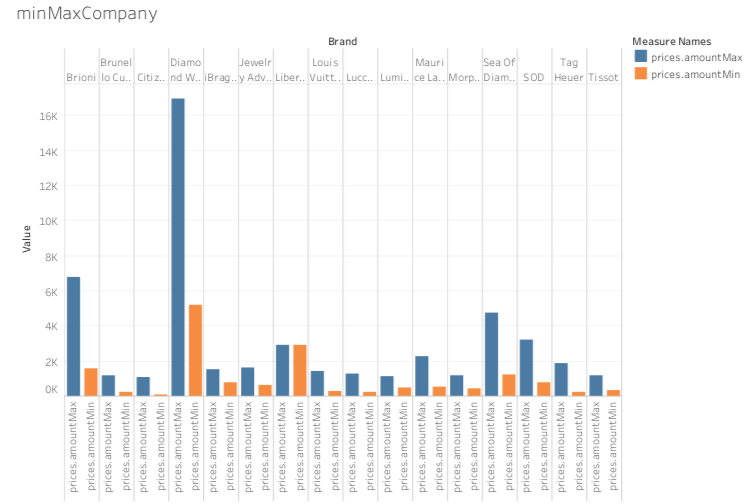

In the above chart we have plotted bar charts for different companies and their respective maximum and minimum prices. Maximum price has been plotted in blue color and minimum price has been plotted in orange color.
From this chart we can segregate Diamond wish and Brioni as premium brands. These kind of products can be advertised for expensive buyers.

## Companies producing light and heavy weight shoes:
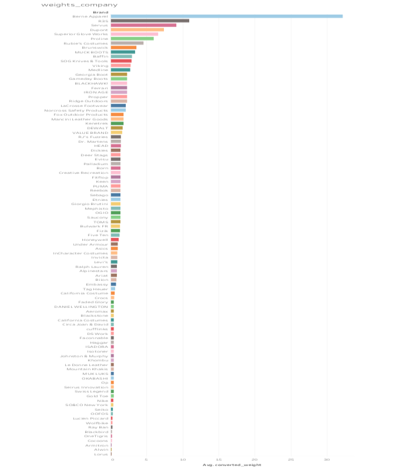
From the above diagram we can observe the companies that are producing foot wear with different weights. Average weights of shoes produced by each companies are visualized in bar chart. This can be used segregate companies into heavy and light weight footwear companies. This data will help the user in selecting the brand by selecting his preference for weight.

## Earnings of different websites:

As we can see from the above pie chart, though the no of sales have been distributed among four websites, the earnings are more distributed across only two websites Walmart and ebay.

## Color sales across different websites:
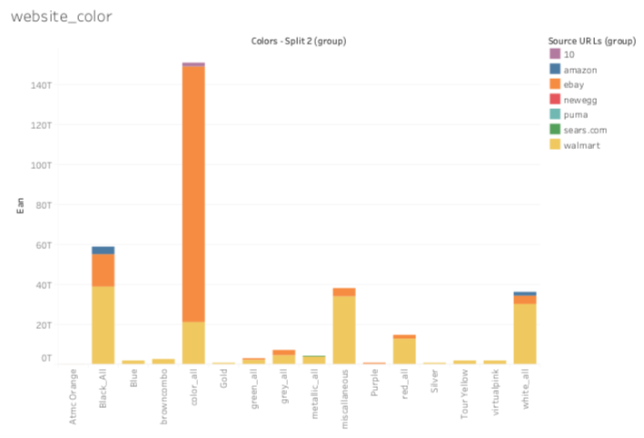
From the above stacked bar graph, we can observe that
1. E-bay sold more of multicolor products
2. Walmart sold miscellaneous colors
3. Amazon sales are particularly high in black color shoes.
